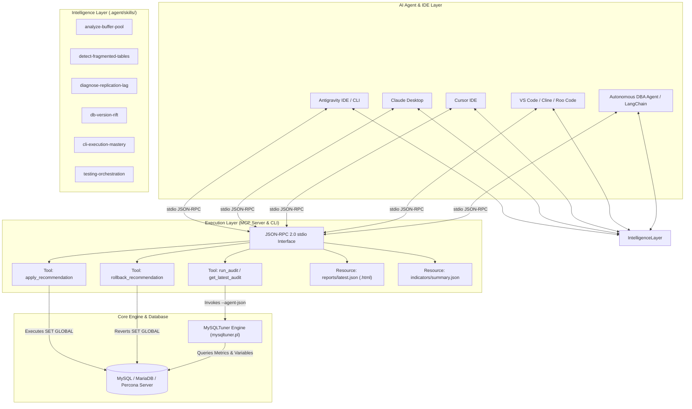
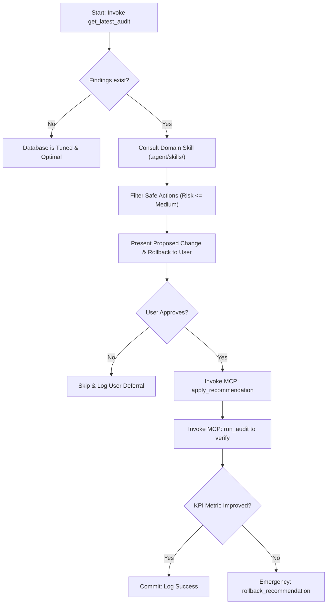

# AI Agent Integration Guide, Model Context Protocol (MCP) & Agent Skills

This document provides exhaustive documentation for integrating MySQLTuner with Artificial Intelligence (AI) agents, autonomous database administrators (DBAs), and developer environments using:
1. **Model Context Protocol (MCP) Server** (runtime execution & resource observability)
2. **AI Agent Skills Subsystem** (specialized diagnostic & domain heuristics)
3. **Direct CLI Telemetry (`--agent-json`)** (high-speed structured ingestion)

---

## 🚀 Architectural Overview

MySQLTuner provides a two-tier AI architecture separating **Heuristic Intelligence** (Skills) from **Runtime Execution & Telemetry** (MCP & CLI):



---

## 1. Model Context Protocol (MCP) Server

The MySQLTuner MCP server ([build/mcp_server.py](file:///build/mcp_server.py)) implements the open standard [Model Context Protocol](https://modelcontextprotocol.io/) via `stdio` transport using JSON-RPC 2.0.

### 🛠️ Exposed MCP Tools (Actions)

Agents invoke these JSON-RPC methods to perform audits, inspect state, and apply safe, reversible database modifications:

#### 1. `get_latest_audit`
* **Purpose**: Retrieves cached audit findings instantly without querying the database server.
* **Arguments**: None.
* **Returns**: JSON payload of findings, severity levels, and actionable statements.

#### 2. `run_audit`
* **Purpose**: Triggers a live execution of `mysqltuner.pl --agent-json` and updates the cache.
* **Arguments**: None.
* **Returns**: Real-time diagnostic report with updated findings.

#### 3. `apply_recommendation`
* **Purpose**: Applies a safe, dynamic SQL tuning adjustment (`SET GLOBAL`) and records the baseline value for rollback.
* **Arguments**:
  - `statement` (string, required): The exact SQL command to execute (e.g., `SET GLOBAL max_connections = 250;`).
  - `variable_name` (string, optional): Target variable to capture pre-execution baseline for rollback.
* **Returns**: Object with execution status and `statement_id` (transaction reference).

#### 4. `rollback_recommendation`
* **Purpose**: Reverts a previously applied SQL modification using recorded transaction baseline state.
* **Arguments**:
  - `statement_id` (string, required): Transaction identifier returned during `apply_recommendation`.
* **Returns**: Object with rollback execution status and restored baseline value.

---

### 📊 Exposed MCP Resources (Observability)

Agents can read these URI resources for static observation and user dashboards:

| Resource URI | MIME Type | Description |
| :--- | :--- | :--- |
| `mysqltuner://reports/latest.json` | `application/json` | Raw telemetry, categorized findings, variables snapshot, and metrics. |
| `mysqltuner://reports/latest.html` | `text/html` | Full interactive pgBadger-style graphical performance dashboard. |
| `mysqltuner://indicators/summary.json` | `application/json` | Consolidated KPI scores (Overall, Performance, Security, Reliability, Modeling). |

---

### 🚀 Client IDE & Agent Configurations

#### 1. Antigravity IDE / CLI (`mcp_config.json`)
```json
{
  "mcpServers": {
    "mysqltuner": {
      "command": "docker",
      "args": [
        "run",
        "-i",
        "--rm",
        "-e", "DB_HOST=127.0.0.1",
        "-e", "DB_PORT=3306",
        "-e", "DB_USER=mysqltuner",
        "-e", "DB_PASSWORD=secret_password",
        "mysqltuner-mcp"
      ]
    }
  }
}
```

#### 2. Claude Desktop (`claude_desktop_config.json`)
```json
{
  "mcpServers": {
    "mysqltuner": {
      "command": "docker",
      "args": [
        "run",
        "-i",
        "--rm",
        "-v", "/var/cache/mysqltuner:/var/cache/mysqltuner",
        "-e", "DB_HOST=host.docker.internal",
        "-e", "DB_USER=root",
        "-e", "DB_PASSWORD=secret_pass",
        "mysqltuner-mcp"
      ]
    }
  }
}
```

#### 3. Cursor IDE (`.cursor/mcp.json`)
```json
{
  "mcpServers": {
    "mysqltuner": {
      "command": "python3",
      "args": ["/absolute/path/to/MySQLTuner-perl/build/mcp_server.py"],
      "env": {
        "DB_HOST": "127.0.0.1",
        "DB_PORT": "3306",
        "DB_USER": "mysqltuner",
        "DB_PASSWORD": "secret_password"
      }
    }
  }
}
```

#### 4. VS Code (Cline / Roo Code)
```json
{
  "mcpServers": {
    "mysqltuner": {
      "command": "python3",
      "args": ["/absolute/path/to/MySQLTuner-perl/build/mcp_server.py"],
      "env": {
        "DB_HOST": "127.0.0.1",
        "DB_USER": "root",
        "DB_PASSWORD": "secret_password"
      }
    }
  }
}
```

---

## 2. AI Agent Skills Subsystem

Skills are specialized procedural domain knowledge capsules stored in `.agent/skills/`. They provide LLM agents with deterministic evaluation algorithms, mathematical formulas, and safe execution guardrails.

### 📚 Skills Catalog

| Skill Name | Location | Operational Domain |
| :--- | :--- | :--- |
| **`analyze_buffer_pool`** | [`.agent/skills/analyze-buffer-pool/SKILL.md`](file:///.agent/skills/analyze-buffer-pool/SKILL.md) | Deep InnoDB Buffer Pool sizing, hit ratio, dirty page flush stalls, and multi-instance concurrency. |
| **`cli-execution-mastery`** | [`.agent/skills/cli-execution-mastery/SKILL.md`](file:///.agent/skills/cli-execution-mastery/SKILL.md) | Mastery of MySQLTuner CLI switches, socket/TCP connections, SSH tunneling, and credential masking. |
| **`db-version-rift`** | [`.agent/skills/db-version-rift/SKILL.md`](file:///.agent/skills/db-version-rift/SKILL.md) | Resolves engine differences and variable deprecations between MySQL (5.5-8.4 LTS) and MariaDB (10.3-11.8 LTS). |
| **`detect-fragmented-tables`** | [`.agent/skills/detect-fragmented-tables/SKILL.md`](file:///.agent/skills/detect-fragmented-tables/SKILL.md) | Storage fragmentation detection, reclaimable disk space calculation, lock risk evaluation, and online defrag commands. |
| **`diagnose-replication-lag`** | [`.agent/skills/diagnose-replication-lag/SKILL.md`](file:///.agent/skills/diagnose-replication-lag/SKILL.md) | Replication latency diagnostics, IO/SQL thread monitoring, GTID synchronization, and parallel worker pool saturation. |
| **`legacy-perl-patterns`** | [`.agent/skills/legacy-perl-patterns/SKILL.md`](file:///.agent/skills/legacy-perl-patterns/SKILL.md) | Guidelines for maintaining zero-dependency backward compatibility with Perl 5.8+ environments. |
| **`testing-orchestration`** | [`.agent/skills/testing-orchestration/SKILL.md`](file:///.agent/skills/testing-orchestration/SKILL.md) | Orchestration of tripartite testing (`--verbose`, `--container`, `--dumpdir`), lab validation, and unit test decomposition. |

---

### 🧩 Anatomy of a Skill (`SKILL.md`)

Each skill directory contains a `SKILL.md` structured with standard YAML frontmatter:

```markdown
---
name: analyze_buffer_pool
description: Deeply analyzes InnoDB Buffer Pool efficiency, hit ratio, memory allocation, and instance concurrency.
trigger: explicit_call
category: skill
---

# AI Skill: InnoDB Buffer Pool Sizing & Efficiency Analysis

## 🧠 Purpose & Operational Objectives
The `analyze_buffer_pool` skill enables autonomous DBA agents to diagnose memory pressure, caching efficiency, and dirty page write stalls.

## 📋 Preconditions & Context
- Server running MySQL 5.5+ or MariaDB 10.0+ with InnoDB enabled.
- Read-only execution: does not execute modifying statements directly.

## 🛠️ Input Parameters
| Parameter | Type | Required | Default | Description |
|:---|:---|:---|:---|:---|
| `target_ram_percentage` | number | No | `75` | Target percentage of host RAM for InnoDB (50-85%). |
| `include_dirty_pages` | boolean | No | `true` | Include dirty page write stall analysis. |

## 📊 Evaluation Criteria & Thresholds
1. **Hit Ratio Formula**: ((read_requests - reads) / read_requests) * 100
   - >= 99%: OPTIMAL
   - 95% - 99%: ACCEPTABLE
   - < 95%: UNDERSIZED (Triggers disk I/O bottleneck)
2. **Dirty Page Ratio**: (pages_dirty / pages_total) * 100
   - > 75%: Checkpoint flushing stall risk.

## 🛡️ Guardrails & Safety
- Dynamic changes: `SET GLOBAL innodb_buffer_pool_size = ...` (MySQL 5.7+ / MariaDB 10.2+).
- Flag `requires_restart: true` for legacy versions or instance count changes.
```

---

### ✍️ Authoring a New Agent Skill

To contribute a new skill to the MySQLTuner repository:
1. Create a dedicated directory under `.agent/skills/<skill-name>/`.
2. Add a `SKILL.md` file with standard YAML frontmatter (`name`, `description`).
3. Define the **Purpose**, **Preconditions**, **Input Parameters**, **Evaluation Formulas**, and **Safety Guardrails**.
4. Synchronize the agent index by running the `/doc-sync` workflow.

---

## 3. Direct CLI Integration: `--agent-json`

When running with `--agent-json`, `mysqltuner.pl` suppresses human ANSI terminal formatting and returns structured JSON to stdout:

```bash
perl mysqltuner.pl --agent-json --host 127.0.0.1 --user root --pass secret
```

### JSON Finding Schema
```json
{
  "findings": [
    {
      "id": "innodb_buffer_pool_size_adjust",
      "topic": "Performance",
      "description": "InnoDB buffer pool size is under-allocated for current workload.",
      "impact_score": 9,
      "risk_level": "Medium",
      "risk_description": "Increases memory consumption. Ensure sufficient OS-free RAM to prevent OOM swapping.",
      "requires_restart": false,
      "expected_outcome": "Reduces disk I/O and increases query cache read hits.",
      "action": {
        "type": "SQL",
        "statement": "SET GLOBAL innodb_buffer_pool_size = 1073741824;",
        "rollback_statement": "SET GLOBAL innodb_buffer_pool_size = 134217728;"
      }
    }
  ]
}
```

---

## 🧠 Autonomous AI Agent Playbook

An AI agent performing database maintenance executes the following closed-loop workflow:



### System Prompt for Autonomous Agents
```markdown
You are a Principal Database Reliability Engineer operating through the MySQLTuner MCP server and Agent Skills.

Operational Directives:
1. Baseline First: Always run `get_latest_audit` before formulating tuning advice.
2. Skill-Driven Evaluation: Use domain rules from `.agent/skills/` (e.g. `analyze_buffer_pool`, `detect-fragmented-tables`) to validate thresholds.
3. Safe Remediation: Only propose `apply_recommendation` when a deterministic `rollback_statement` is provided and user consent is granted.
4. Validation Loop: Post-change, call `run_audit` to verify KPI health improvement. If latency or error metrics regress, immediately trigger `rollback_recommendation`.
```

