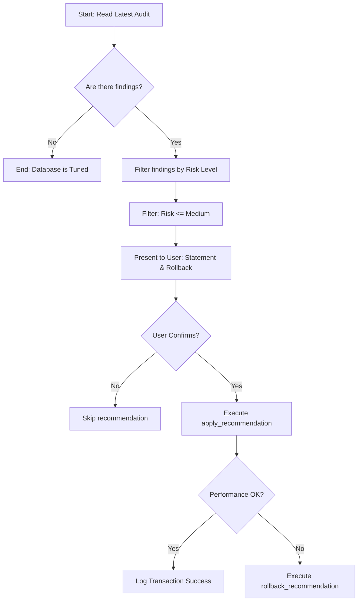

# AI Agent Integration Guide & Model Context Protocol (MCP) Server

This document explains how AI coding assistants, autonomous database agents, and developer workflows can utilize MySQLTuner via the **Model Context Protocol (MCP)** or direct `--agent-json` CLI queries to audit and optimize database instances safely.

---

## 🚀 Overview of Integration Modes

MySQLTuner supports two native modes for machine integration:
1. **Direct CLI (`--agent-json` mode)**: High-speed, zero-dependency JSON output representing actionable recommendations. Excellent for scripts and one-off agent executions.
2. **MCP Server (stdio transport)**: Standardized protocol interface exposing tools and resources for LLM agents to query state, run audits, and execute rollback-enabled database optimizations.

---

## 1. Direct CLI Integration: `--agent-json`

When running with `--agent-json`, MySQLTuner suppresses all human-readable ANSI terminal outputs and prints a single, structured JSON payload to stdout containing actionable findings.

### CLI Invocation
```bash
perl mysqltuner.pl --agent-json --host <db_host> --user <db_user> --pass <db_pass>
```

### Output Schema Definition
Each recommendation returned in the `findings` list adheres to the following structure:

- **`id`**: Unique deterministic identifier for the recommendation type (e.g., `innodb_buffer_pool_size_adjust`).
- **`topic`**: Category of the finding (`Performance`, `Security`, `Reliability`, `Modeling`, `Replication`).
- **`description`**: Human-readable explanation of the issue.
- **`impact_score`**: Estimated benefit score from `1` (lowest) to `10` (highest).
- **`risk_level`**: Safety assessment associated with applying the recommendation (`Low`, `Medium`, `High`, `Critical`).
- **`risk_description`**: Potential side effects (e.g. table locks, memory consumption).
- **`requires_restart`**: Boolean (`true`/`false`) indicating if the change requires restarting the database service.
- **`expected_outcome`**: Predicted benefit (e.g. "Reduces disk I/O").
- **`action`**: Object containing:
  - `type`: Either `SQL` (can be executed live) or `Config` (requires editing `my.cnf`).
  - `statement`: The exact statement to execute or configuration line to write.
  - `rollback_statement`: The exact command to revert the action to its original baseline state.

### Actionable JSON Output Example
```json
{
  "findings": [
    {
      "id": "innodb_buffer_pool_size_adjust",
      "topic": "Performance",
      "description": "InnoDB buffer pool size is under-allocated for the current workload.",
      "impact_score": 9,
      "risk_level": "Medium",
      "risk_description": "Increases memory consumption. Ensure sufficient OS-free RAM to prevent OOM swapping.",
      "requires_restart": false,
      "expected_outcome": "Reduces disk I/O and increases query cache read hits.",
      "action": {
        "type": "SQL",
        "statement": "SET GLOBAL innodb_buffer_pool_size = 1073741824;",
        "rollback_statement": "SET GLOBAL innodb_buffer_pool_size = 134217728;"
      }
    }
  ]
}
```

---

## 2. Model Context Protocol (MCP) Integration

The containerized MCP server integrates directly with client systems (like Cursor, Claude Desktop, Antigravity, or custom LangChain/LlamaIndex pipelines).

### Running the MCP Service Container
Deploy the Docker image next to your database server:
```bash
docker run -d \
  --name mysqltuner-mcp \
  -e DB_HOST=mysql-server \
  -e DB_USER=root \
  -e DB_PASSWORD=secret_pass \
  -e AUDIT_INTERVAL_HOURS=12 \
  -v /var/cache/mysqltuner:/var/cache/mysqltuner \
  mysqltuner-mcp
```

### Connecting to the MCP Server
Clients communicate with the server over **stdio** (standard input/output) transport.
Configure your agent IDE config (e.g. `project_config.json` or CLAUDE desktop config) to spawn the server:
```json
{
  "mcpServers": {
    "mysqltuner": {
      "command": "docker",
      "args": ["run", "-i", "--rm", "-e", "DB_HOST=127.0.0.1", "mysqltuner-mcp"]
    }
  }
}
```

---

## 🛠️ Exposed MCP Tools & Resources

### MCP Resources (Observability)
- **`mysqltuner://reports/latest.json`**: Accesses the latest cached JSON report containing findings and DB variables status.
- **`mysqltuner://reports/latest.html`**: Retreives the complete interactive pgBadger-inspired HTML analytics dashboard.

### MCP Tools (Actions)
Agents can invoke these JSON-RPC methods:

1. **`get_latest_audit`**
   - *Description*: Retrieves cached audit findings instantly without stressing the database.
   - *Arguments*: None.

2. **`run_audit`**
   - *Description*: Triggers a fresh run of the Perl engine and returns immediate recommendations.
   - *Arguments*: None.

3. **`apply_recommendation`**
   - *Description*: Applies a safe `SQL` adjustment (e.g. `SET GLOBAL`).
   - *Arguments*: 
     - `statement` (string, required): The SQL command to execute.
     - `variable_name` (string, optional): Variable name being changed to capture and save the rollback state.

4. **`rollback_recommendation`**
   - *Description*: Reverts a previously executed command using cached transaction state.
   - *Arguments*:
     - `statement_id` (string, required): The ID of the transaction to revert.

---

## 🧠 Step-by-Step AI Agent Playbook

An AI agent performing database maintenance should follow this operational path:



### Agent Prompt Instructions Template (Copy-Paste for LLM Context)
> "You have access to the MySQLTuner MCP server. Your goal is to analyze database performance, propose optimizations, and execute them safely.
> 1. Run `get_latest_audit` to fetch current recommendations.
> 2. For each recommendation, analyze the `impact_score`, `risk_level`, and `requires_restart`.
> 3. Highlight recommendations with high `impact_score` (>=7) and safe `risk_level` (Low or Medium).
> 4. Present these recommendations to the user, showing the `description`, the exact `statement` to apply, and the `rollback_statement`.
> 5. Wait for user consent.
> 6. After confirmation, call `apply_recommendation` to execute the SQL.
> 7. If the user complains of issues or latency spikes, run `rollback_recommendation` immediately with the returned `statement_id` to restore original performance levels."
