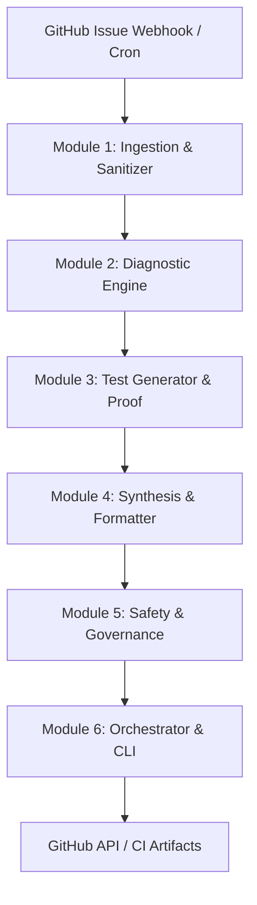

# 🏛️ Architecture & Reference Guide: Autonomous Issue Triage System

## 1. 🎯 Executive Summary & Mission

The **MySQLTuner Autonomous Issue Triage System** provides an automated, reproducible, and verifiable engineering pipeline for triaging, diagnosing, reproducing, and resolving GitHub issues submitted to the `jmrenouard/MySQLTuner-perl` repository.

### Key Tenets
1. **Maintainer Shield**: Tickets authored by maintainer `@jmrenouard` are strictly held (`triage:maintainer-review`) and never auto-closed with canned responses.
2. **Deterministic Verification**: Every resolution must generate a real, standalone Perl `Test::More` test file (`tests/test_issue_XXX.t`) executing structured subtests.
3. **Traceability**: All comments, closures, and diagnostic reports reference exact commit SHAs, reproducible shell scripts, and official DBMS documentation.
4. **Resilient Ingestion**: Cascading multi-transport architecture (GraphQL v4 $\rightarrow$ REST v3 $\rightarrow$ `gh` CLI $\rightarrow$ Offline Replay).
5. **Zero-Dependency Core**: All client code adheres to standard Python 3.10+ library modules and Perl Core modules.

---

## 2. 🧩 6-Module Subsystem Architecture



### Module 1: Ingestion & Sanitizer (`build/issue_triage/github_ingest.py`, `sanitizer.py`)
- Sanitizes ANSI escape sequences and dangerous HTML.
- Redacts sensitive secrets (AWS keys, GitHub tokens, MySQL credentials, private keys).
- Manages rate-limiting with exponential jitter backoff and checkpoint pagination.

### Module 2: Analysis & Diagnostic Engine (`build/issue_triage/diagnostic_engine.py`)
- **Taxonomy Resolver**: Disambiguates MySQL, MariaDB (including `5.5.5-` prefix), Percona, Aurora, RDS, and Cloud SQL.
- **Expert Diagnostics**:
  - Memory Footprint & OOM Risk Calculator (`memory_footprint_calculator.py`)
  - InnoDB Buffer Pool & Instances Sizing (`innodb_expert_diagnostics.py`)
  - Table Cache & System File Descriptors (`table_cache_diagnostics.py`)
  - HA & Replication Topologies (Galera, Async, Semi-Sync) (`ha_replication_diagnostics.py`)
  - Security, TLS & Authentication (`security_auth_diagnostics.py`)
  - Performance Schema & Query Profiling (`pfs_query_diagnostics.py`)
  - Variable Deprecation Lifecycle Matrix (`deprecation_matrix.py`)

### Module 3: Test Generation & Proof Validation (`build/issue_triage/test_generator.py`)
- Synthesizes compliant Perl `Test::More` scripts with structured `subtest` blocks.
- Validates syntax via `perl -c` and execution via `Test::Harness` / `prove`.
- Generates reproducible Docker multi-DB scenarios (`docker_scenario_generator.py`).

### Module 4: Contextual Synthesis & Formatter (`build/issue_triage/response_synthesizer.py`)
- Formats structured Markdown replies with warm community gratitude for third-party developers.
- Generates copy-pasteable `my.cnf` / `mariadb.conf.d` configuration snippets with rationale comments.
- Embeds verifiable test links anchored to specific Git commit SHAs.

### Module 5: Governance & Invariant Safety Checklist (`build/issue_triage/pre_closing_checklist.py`, `closing_governance.py`)
- Audits 7 hard invariants before any mutation or closure:
  1. `INVARIANT_AUTHOR_NON_MAINTAINER`
  2. `INVARIANT_SYNTAX_VALID`
  3. `INVARIANT_TEST_PASSING`
  4. `INVARIANT_DOC_LINK_PRESENT`
  5. `INVARIANT_RESPONSE_NON_EMPTY`
  6. `INVARIANT_COMMIT_PINNED`
  7. `INVARIANT_SANITIZATION_PASSED`

### Module 6: CLI & Workflow Orchestrator (`build/issue_triage/triage_orchestrator.py`, `.github/workflows/issue_triage.yml`)
- Provides unified CLI with `--dry-run`, `--issue`, `--offline`, `--repo`, and `--sync-upstream`.
- Seamlessly integrates with GitHub Actions for automated event-driven triage.

---

## 3. 🔄 Upstream Synchronization (`major/MySQLTuner-perl`)

Per project governance rules, every modification and new feature developed for `jmrenouard/MySQLTuner-perl` can be cross-synchronized with the upstream `major/MySQLTuner-perl` repository:
- **Assignee Rule**: All synchronized upstream issues are automatically assigned to `@jmrenouard`.
- **Classification & Tags**: Commits and pull requests are mapped to upstream labels (`bug`, `enhancement`, `documentation`, `performance`, `db:mysql84`, `db:mariadb114`).
- **Cross-Referenced Proofs**: Upstream responses link directly to verifiable test proof artifacts (`tests/test_issue_XXX.t`) and Git commit SHAs in `jmrenouard/MySQLTuner-perl`.
- **Maintainer Shield**: Issues created by `@jmrenouard` in `major/MySQLTuner-perl` maintain the maintainer shield (`triage:maintainer-review`) and are protected against automated closing.

---

## 4. 💻 Developer Commands & Usage

```bash
# Run all Python and Perl issue triage unit tests
make test-triage

# Run issue triage in dry-run mode on downstream (first 10 issues)
make issue-triage LIMIT=10

# Run issue triage in offline mode using mock fixtures
make issue-triage-offline

# Run upstream triage against major/MySQLTuner-perl (live / dry-run)
make issue-triage-major LIMIT=10

# Run upstream triage against major/MySQLTuner-perl using offline fixtures
make issue-triage-major-offline

# Synchronize local modifications to major/MySQLTuner-perl with jmrenouard assignment
make sync-major-issues

# Target a specific issue in live mode
python3 build/issue_triage/triage_orchestrator.py --issue 881 --live
```
