# Quality Assurance, Testing, and CI/CD Infrastructure

This document provides a comprehensive overview of the testing infrastructure, verification scripts, quality gates, and GitHub Actions CI/CD workflows configured for MySQLTuner-perl.

---

## 🛠️ Verification & Quality Scripts Reference

All scripts supporting project compliance, validation, and testing reside in the `build/` directory.

### Summary Table

| Script Name | Path | Purpose | Key Parameters / Options | Trigger Command |
| :--- | :--- | :--- | :--- | :--- |
| **Compliance Sentinel** | [check_compliance.pl](file:///MySQLTuner-perl/build/check_compliance.pl) | Enforces single-file design and zero CPAN dependency policies. | None | `perl build/check_compliance.pl` |
| **EOL Synchronizer** | [sync_eol_dates.pl](file:///MySQLTuner-perl/build/sync_eol_dates.pl) | Audits and flags outdated/EOL minor versions by querying endoflife.date APIs. | None | `perl build/sync_eol_dates.pl` |
| **Test Output Auditor** | [audit_tests.pl](file:///MySQLTuner-perl/build/audit_tests.pl) | Runs the unit test suite (`prove -r tests/`) and audits runtime logs for warnings. | `[CMD]` (Custom test command, defaults to `prove -r tests/`) | `make unit-tests` |
| **Laboratory Orchestrator** | [test_envs.sh](file:///MySQLTuner-perl/build/test_envs.sh) | Orchestrates multi-DB containerized integration tests across 4 scenario phases. | `[CONFIG]` (Target DB configuration, e.g., `mysql84`), `--keep-alive`, `--verbose` | `make test CONFIGS=mysql84` |
| **Laboratory Log Auditor** | [audit_logs.pl](file:///MySQLTuner-perl/build/audit_logs.pl) | Audits execution logs generated by laboratory tests for warnings and SQL errors. | `--dir=[PATH]` (Log directory), `--verbose` | `make audit-logs` |
| **Parallel Lab Test Runner** | [parallel_test.sh](file:///MySQLTuner-perl/build/parallel_test.sh) | Executes laboratory tests in parallel using xargs to accelerate validation. | None | `make test-parallel` |
| **Cleanup Utility** | [clean_examples.sh](file:///MySQLTuner-perl/build/clean_examples.sh) | Keeps the `examples/` directory lean by pruning oldest test run folders. | `[KEEP]` (Number of folders to retain, default 5) | `make clean_examples KEEP=10` |
| **EOL Docs Builder** | [endoflife.sh](file:///MySQLTuner-perl/build/endoflife.sh) | Generates database support status Markdown files. | `[product]` (e.g. `mysql` or `mariadb`) | `make generate_eof_files` |
| **Docker Publisher** | [publishtodockerhub.sh](file:///MySQLTuner-perl/build/publishtodockerhub.sh) | Shell script to build, tag, and push official images to Docker Hub. | `[VERSION]` (Tag version) | `make docker_push VERSION=2.8.44` |
| **RPM Package Builder** | [build_rpm.sh](file:///MySQLTuner-perl/build/build_rpm.sh) | Shell script that orchestrates local builds of RedHat RPM packages. | None | `bash build/build_rpm.sh` |
| **CVE List Builder (Perl)** | [updateCVElist.pl](file:///MySQLTuner-perl/build/updateCVElist.pl) | Downloads and compiles vulnerabilities list into CSV format. | None | `perl build/updateCVElist.pl` |
| **CVE List Builder (Python)** | [updateCVElist.py](file:///MySQLTuner-perl/build/updateCVElist.py) | Python-based alternative script to query CVE data APIs. | None | `python3 build/updateCVElist.py` |
| **Supported Envs Query** | [get_supported_envs.pl](file:///MySQLTuner-perl/build/get_supported_envs.pl) | Parses configuration file to return list of supported lab database targets. | None | `perl build/get_supported_envs.pl` |
| **Feature Docs Builder** | [genFeatures.sh](file:///MySQLTuner-perl/build/genFeatures.sh) | Scans inline comments to rebuild the feature summary document. | None | `bash build/genFeatures.sh` |
| **Release Note Generator** | [release_gen.py](file:///MySQLTuner-perl/build/release_gen.py) | Python utility that parses commit history and builds release notes markdown. | None | `python3 build/release_gen.py` |
| **Sample Database Fetcher** | [fetchSampleDatabases.sh](file:///MySQLTuner-perl/build/fetchSampleDatabases.sh) | Downloads standard databases (like employees) for lab schema injection. | None | `bash build/fetchSampleDatabases.sh` |
| **Mock Refactoring Tool** | [refactor_mocks.pl](file:///MySQLTuner-perl/build/refactor_mocks.pl) | Utility to update mocks and SQL query responses in legacy unit tests. | None | `perl build/refactor_mocks.pl` |
| **Spec Auditor** | [audit_specifications.pl](file:///MySQLTuner-perl/build/audit_specifications.pl) | Parses specifications to check headings, local links, YAML frontmatter, and updates matrix. | None | `perl build/audit_specifications.pl` |
| **LTS Auto-Bumper** | [lts_autobump.pl](file:///MySQLTuner-perl/build/lts_autobump.pl) | Automatically audits endoflife.date cycles and updates supported LTS lists in mysqltuner.pl and test files. | None | `perl build/lts_autobump.pl` |

*(Note: Data and template assets like `mysql_mariadb_cve_full.csv`, `configimg.conf`, and `mysqltuner.spec.tpl` are documented below).*

---

## 🏃 Detailed Quality Workflows & Steps

### 1. Static Compliance Audits
Ensures code additions adhere to the Zero-Dependency CPAN standard and strict Single-File Architecture.
- **Path**: [check_compliance.pl](file:///MySQLTuner-perl/build/check_compliance.pl)
- **Functionality**: Parses `mysqltuner.pl` using standard regexes to verify that:
  - No `use` or `require` directives import non-Core Perl modules.
  - The script has not been split into external files.
- **Step-by-step**:
  1. Parse [mysqltuner.pl](file:///MySQLTuner-perl/mysqltuner.pl).
  2. Inspect module imports and validate against a whitelist of Core modules.
  3. Exit with `0` on success, or `1` with a detailed compliance failure report.

### 2. Automated EOL Synchronization Check
Checks if the LTS support list defined in `mysqltuner.pl` is in sync with real-time endoflife.date releases.
- **Path**: [sync_eol_dates.pl](file:///MySQLTuner-perl/build/sync_eol_dates.pl)
- **Functionality**:
  - Connects to the EOL APIs (`https://endoflife.date/api/mysql.json` and `https://endoflife.date/api/mariadb.json`).
  - Filters cycles that are still active (where EOL date is in the future).
  - Inspects `validate_mysql_version()` inside [mysqltuner.pl](file:///MySQLTuner-perl/mysqltuner.pl) to find all declared versions.
  - Emits errors and exits with `1` if a supported version is missing, or if an EOL-ed version is still listed as supported (excluding whitelisted legacy ones like `8.0`).
- **Step-by-step**:
  1. Fetch EOL cycles from APIs via standard Perl `HTTP::Tiny`.
  2. Fall back gracefully (exit `0`) if no internet access is available (offline mode).
  3. Validate cycle dates against the current system date.
  4. Compare parsed active cycles with the version mapping logic inside the main script.

### 3. Unit and Regression Testing
Executes unit tests and monitors test output for runtime errors, typos, and deprecations.
- **Path**: [audit_tests.pl](file:///MySQLTuner-perl/build/audit_tests.pl)
- **Functionality**:
  - Compiles the main script and test files (`perl -wc`) to check for syntax issues.
  - Spawns `prove -r tests/` to run all mock-based unit tests.
  - Monitored real-time stream logs for anomalies: Perl warnings (uninitialized values, typos), SQL exceptions, runtime invocation failures, and memory errors.
- **Step-by-step**:
  1. Run compile-time checks (`perl -wc`) on all source/test files.
  2. Execute the test suite via the test auditor command.
  3. Scan line-by-line for warning patterns.
  4. Exit with non-zero code if test failures or critical errors are intercepted.

### 4. Database Laboratory Integration Testing
Runs MySQLTuner against real, running containerized databases under diverse environment scenarios.
- **Path**: [test_envs.sh](file:///MySQLTuner-perl/build/test_envs.sh)
- **Functionality**: Manages database container lifecycles (using the [multi-db-docker-env](file:///home/jmren/GIT_REPOS/multi-db-docker-env) framework) and validates findings.
- **Scenarios**:
  - **Standard**: Executes the script over a TCP connection (`--host 127.0.0.1`).
  - **Container**: Executes the script forcing container abstraction (`--container docker:mysql-8.4`).
  - **Dumpdir**: Runs offline file-based audits against dumped config/status files (`--dumpdir`).
  - **Schemadir**: Performs schema structure scans (`--schemadir`) on local schema dump files.
- **Step-by-step**:
  1. Start the target database container (e.g. `mysql84`).
  2. Wait for database socket readiness using health checks.
  3. Inject standard test schemas (using the [test_db](https://github.com/jmrenouard/test_db) sample datasets).
  4. Run MySQLTuner across the four scenarios, outputting recommendations and generating premium HTML reports.
  5. Shut down the containers and clean up volumes.

### 5. Laboratory Logs Audit
Performs post-test scans on laboratory run logs to identify errors missed by standard wrappers.
- **Path**: [audit_logs.pl](file:///MySQLTuner-perl/build/audit_logs.pl)
- **Functionality**: Scans files within the `examples/` directory for uninitialized value warnings or failed SQL statements.
- **Step-by-step**:
  1. Locates all `execution.log` and output files under `examples/`.
  2. Iterates line-by-line looking for keywords: `Use of uninitialized value`, `FAIL Execute SQL`, and `Performance_schema should be activated`.
  3. If anomalies are found, records them in `POTENTIAL_ISSUES` at the project root.

### 6. Specification Consistency Auditor
Enforces heading standards, local file resolution, YAML metadata parsing, and updates the traceability matrix.
- **Path**: [audit_specifications.pl](file:///MySQLTuner-perl/build/audit_specifications.pl)
- **Functionality**:
  - Parses each spec file in `documentation/specifications/` to check for Markdown structure.
  - Checks if files referenced by `file:///` URLs exist.
  - Rebuilds the QA matrix inside `QUALITY_AND_TESTING.md`.
  - Distinguishes strict checks on modified/new specs via `git status --porcelain`.
- **Step-by-step**:
  - Check the list of specs under the specifications folder.
  - Identify specs modified or added via git status.
  - Run markdown formatting checks, link verification, and YAML metadata checks.
  - Fail the build on any strict error, or warn on legacy files.

### 7. LTS Version Auto-Bumper
Queries endoflife.date APIs, matches supported cycles, and updates the validation code block and unit tests.
- **Path**: [lts_autobump.pl](file:///MySQLTuner-perl/build/lts_autobump.pl)
- **Functionality**:
  - Automatically queries EOL API endpoints.
  - Patches `validate_mysql_version()` inside `mysqltuner.pl` and test coverage tables inside `tests/test_vulnerabilities.t`.
- **Step-by-step**:
  - Run weekly cron job in GitHub Actions.
  - Detect version mismatches.
  - Update files inline.
  - Submit an automated Pull Request with version bumps.

### 8. Auxiliary & Package Build Assets
- **Docker Publisher** ([publishtodockerhub.sh](file:///MySQLTuner-perl/build/publishtodockerhub.sh)): Automatically handles docker tag builds and publisher hooks.
- **RPM Builder** ([build_rpm.sh](file:///MySQLTuner-perl/build/build_rpm.sh) & [mysqltuner.spec.tpl](file:///MySQLTuner-perl/build/mysqltuner.spec.tpl)): Packages MySQLTuner for RedHat/CentOS platforms.
- **Config & Data Assets** ([configimg.conf](file:///MySQLTuner-perl/build/configimg.conf) & [mysql_mariadb_cve_full.csv](file:///MySQLTuner-perl/build/mysql_mariadb_cve_full.csv)): Database image manifests and static CVE list.
- **Mock Refactorer** ([refactor_mocks.pl](file:///MySQLTuner-perl/build/refactor_mocks.pl)): Batch refactors query responses in legacy unit test specs.
- **Release Gen** ([release_gen.py](file:///MySQLTuner-perl/build/release_gen.py)): Python script that aggregates changelogs and git logs to compile release notes.

---

## ☁️ GitHub Actions CI/CD Pipeline

The GitHub Actions pipeline is defined in [.github/workflows/pull_request.yml](file:///MySQLTuner-perl/.github/workflows/pull_request.yml). It is configured to execute automatically on pushes and pull requests to all branches.

### Workflow Jobs & Verification Steps

```mermaid
graph TD
    A[Trigger: Push or PR] --> B[test_help]
    A --> C[test_with_empty_db]
    A --> D[unit_tests]
    
    subgraph Job: test_help
        B1[Checkout Repo] --> B2[Inject .my.cnf]
        B2 --> B3[Start MySQL 5.7 & 8.0]
        B3 --> B4[Run mysqltuner.pl --help]
        B4 --> B5{Check warnings}
        B5 -->|Found warnings| B6[Fail Build]
        B5 -->|Clean| B7[Pass]
    end

    subgraph Job: test_with_empty_db
        C1[Checkout Repo] --> C2[Inject .my.cnf]
        C2 --> C3[Start MySQL 5.7 & 8.0]
        C3 --> C4[Run mysqltuner.pl --verbose]
        C4 --> C5{Check warnings}
        C5 -->|Found warnings| C6[Fail Build]
        C5 -->|Clean| C7[Pass]
    end

    subgraph Job: unit_tests
        D1[Checkout Repo] --> D2[Run Compliance Checks]
        D2 --> D3[Run EOL Synchronization Check]
        D3 --> D4[Run unit-tests via audit_tests.pl]
        D4 --> D5[Audit test logs for warnings]
    end
```



### Job Details

#### 1. Job: `test_help`
- **Runs on**: `ubuntu-latest`
- **Environment**: Matrix testing MySQL `5.7` and `8.0` containers.
- **Objective**: Verifies the CLI can print help and basic information on a fresh system without emitting syntax or runtime errors.
- **Detailed Steps**:
  1. Checkout code (`actions/checkout@v6`).
  2. Setup credentials file `$HOME/.my.cnf` containing root access configs.
  3. Wait 20 seconds for the service containers to initialize.
  4. Execute:
     ```bash
     sudo perl ./mysqltuner.pl --help 2>&1 | tee output.log
     ```
  5. Quality check: Fails the build if `Use of uninitialized value` is present in the logs.

#### 2. Job: `test_with_empty_db`
- **Runs on**: `ubuntu-latest`
- **Environment**: Matrix testing MySQL `5.7` and `8.0` containers.
- **Objective**: Evaluates connection, privilege auditing, and default configuration analysis against an empty database.
- **Detailed Steps**:
  1. Checkout code.
  2. Setup credentials file.
  3. Wait 20 seconds for database container readiness.
  4. Run MySQLTuner in verbose mode:
     ```bash
     sudo perl ./mysqltuner.pl --user=root --pass=root --protocol tcp --verbose 2>&1 | tee output.log
     ```
  5. Quality check: Fails build if uninitialized warnings are detected.

#### 3. Job: `unit_tests`
- **Runs on**: `ubuntu-latest`
- **Objective**: Enforces compliance limits, EOL synchronization audits, and runs mock unit tests.
- **Detailed Steps**:
  1. Checkout code.
  2. **Run compliance checks**:
     ```bash
     perl build/check_compliance.pl
     ```
  3. **Run EOL dates synchronization check**:
     ```bash
     perl build/sync_eol_dates.pl
     ```
  4. **Run unit tests**:
     ```bash
     make unit-tests
     ```
     This executes `build/audit_tests.pl` which runs `prove -r tests/` and scans the test stream output for uninitialized values, syntax issues, and runtime execution errors.


## 🗺️ Verification Traceability Matrix

<!-- SPEC_TEST_MATRIX_START -->
### 🗺️ Specification-to-Test Suite Mapping Matrix

| Specification Document | Path | Target Test File / Suite |
| :--- | :--- | :--- |
| **Authentication Plugin Security Checks** | [auth_plugin_security_checks.md](file:///MySQLTuner-perl/documentation/specifications/auth_plugin_security_checks.md) | N/A |
| **Automated EOL Date Synchronization** | [automated_eol_sync.md](file:///MySQLTuner-perl/documentation/specifications/automated_eol_sync.md) | [tests/test_vulnerabilities.t](file:///MySQLTuner-perl/tests/test_vulnerabilities.t) |
| **CLI Execution Mastery Skill** | [cli_execution_skill.md](file:///MySQLTuner-perl/documentation/specifications/cli_execution_skill.md) | N/A |
| **Metadata-Driven CLI Options Refactor (Phase 6)** | [cli_metadata_refactor.md](file:///MySQLTuner-perl/documentation/specifications/cli_metadata_refactor.md) | N/A |
| **Compliance Sentinel - Remembers Integration** | [compliance_sentinel_remembers.md](file:///MySQLTuner-perl/documentation/specifications/compliance_sentinel_remembers.md) | N/A |
| **Documentation Synchronization Enhancement** | [doc_sync_enhancement.md](file:///MySQLTuner-perl/documentation/specifications/doc_sync_enhancement.md) | N/A |
| **Fix --dumpdir TRUE/FALSE logic** | [dumpdir_logic_fix.md](file:///MySQLTuner-perl/documentation/specifications/dumpdir_logic_fix.md) | N/A |
| **Specification - Performance Schema `Error Log` Analysis** | [error_log_pfs.md](file:///MySQLTuner-perl/documentation/specifications/error_log_pfs.md) | N/A |
| **Robust Password Column Detection in mysqltuner.pl** | [fix_password_column_detection.md](file:///MySQLTuner-perl/documentation/specifications/fix_password_column_detection.md) | N/A |
| **Index Checks via Performance Schema** | [index_checks_pfs.md](file:///MySQLTuner-perl/documentation/specifications/index_checks_pfs.md) | N/A |
| **Warn if current user does not have minimum privileges** | [issue_25_privilege_checks.md](file:///MySQLTuner-perl/documentation/specifications/issue_25_privilege_checks.md) | N/A |
| **MySQL 9.x Support** | [mysql_9_x_support.md](file:///MySQLTuner-perl/documentation/specifications/mysql_9_x_support.md) | N/A |
| **Performance Schema Audit Logic** | [performance_schema_audit.md](file:///MySQLTuner-perl/documentation/specifications/performance_schema_audit.md) | N/A |
| **Performance Schema Observability Warning** | [performance_schema_observability_warning.md](file:///MySQLTuner-perl/documentation/specifications/performance_schema_observability_warning.md) | N/A |
| **Perltidy Integration in Release Preflight** | [perltidy_integration.md](file:///MySQLTuner-perl/documentation/specifications/perltidy_integration.md) | N/A |
| **Persistent Lab Environment** | [persistent_lab.md](file:///MySQLTuner-perl/documentation/specifications/persistent_lab.md) | N/A |
| **Regex Robustness for Minor and Micro Releases** | [regex_robustness_versioning.md](file:///MySQLTuner-perl/documentation/specifications/regex_robustness_versioning.md) | [tests/test_vulnerabilities.t](file:///MySQLTuner-perl/tests/test_vulnerabilities.t) |
| **Specification - Release Manager** | [release_manager_specification.md](file:///MySQLTuner-perl/documentation/specifications/release_manager_specification.md) | N/A |
| **Roadmap Phase IV - Advanced Intelligence & Ecosystem** | [roadmap_phase_iv_intelligence.md](file:///MySQLTuner-perl/documentation/specifications/roadmap_phase_iv_intelligence.md) | N/A |
| **Roadmap Phase IX - Data Integrity & Checksum Verification** | [roadmap_phase_ix_integrity.md](file:///MySQLTuner-perl/documentation/specifications/roadmap_phase_ix_integrity.md) | N/A |
| **Roadmap Phase V - Deep InnoDB Tuning & Safeguarding** | [roadmap_phase_v_innodb.md](file:///MySQLTuner-perl/documentation/specifications/roadmap_phase_v_innodb.md) | N/A |
| **Roadmap Phase VI - High Availability & InnoDB Cluster** | [roadmap_phase_vi_innodb_cluster.md](file:///MySQLTuner-perl/documentation/specifications/roadmap_phase_vi_innodb_cluster.md) | N/A |
| **Roadmap Phase VII - Modern Replication & GTID Mastery** | [roadmap_phase_vii_replication.md](file:///MySQLTuner-perl/documentation/specifications/roadmap_phase_vii_replication.md) | N/A |
| **Roadmap Phase VIII - Galera Cluster 4 & PXC 8.0 Mastery** | [roadmap_phase_viii_galera.md](file:///MySQLTuner-perl/documentation/specifications/roadmap_phase_viii_galera.md) | N/A |
| **Roadmap Phase XI - Advanced Log Parser & Lock Monitoring** | [roadmap_phase_xi_log_parser.md](file:///MySQLTuner-perl/documentation/specifications/roadmap_phase_xi_log_parser.md) | N/A |
| **Roadmap Phase XII - Sectional Global Indicators & KPIs** | [roadmap_phase_xii_sectional_indicators.md](file:///MySQLTuner-perl/documentation/specifications/roadmap_phase_xii_sectional_indicators.md) | N/A |
| **Roadmap Phase XIII - Export Optimization & Dumpdir Hardening** | [roadmap_phase_xiii_export_optimization.md](file:///MySQLTuner-perl/documentation/specifications/roadmap_phase_xiii_export_optimization.md) | N/A |
| **--schemadir option for Schema Documentation** | [schemadir_option_specification.md](file:///MySQLTuner-perl/documentation/specifications/schemadir_option_specification.md) | N/A |
| **SSL/TLS Security Enhancements** | [ssl_tls_enhancements.md](file:///MySQLTuner-perl/documentation/specifications/ssl_tls_enhancements.md) | N/A |
| **SSL/TLS Security Checks** | [ssl_tls_security_checks.md](file:///MySQLTuner-perl/documentation/specifications/ssl_tls_security_checks.md) | N/A |
| **Specification - Syslog and Systemd Journal Support for MariaDB/MySQL** | [syslog_systemd_support.md](file:///MySQLTuner-perl/documentation/specifications/syslog_systemd_support.md) | N/A |
| **Test Coverage Expansion** | [test_coverage_expansion.md](file:///MySQLTuner-perl/documentation/specifications/test_coverage_expansion.md) | [tests/unit_system.t](file:///MySQLTuner-perl/tests/unit_system.t) |
| **Advanced Test Log Auditing** | [test_log_auditing.md](file:///MySQLTuner-perl/documentation/specifications/test_log_auditing.md) | N/A |

<!-- SPEC_TEST_MATRIX_END -->
