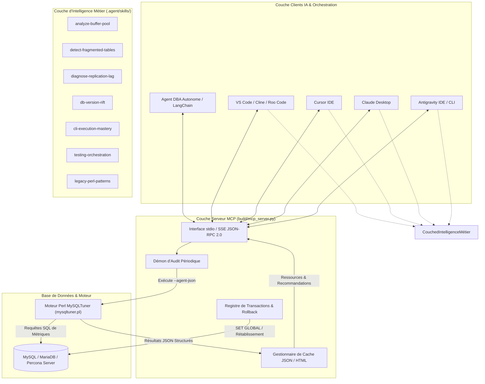

# Guide d'Intégration Agent IA, Model Context Protocol (MCP) & Compétences (Skills)

Ce document fournit la documentation technique complète pour intégrer MySQLTuner avec des agents d'Intelligence Artificielle (IA), des assistants de code LLM, des pipelines d'administration automatique de bases de données (DBA) et des environnements de développement (Antigravity, Claude Desktop, Cursor, VS Code) via le **Model Context Protocol (MCP)**, le **Sous-système de Compétences IA (Agent Skills)** et la télémétrie CLI `--agent-json`.

---

## 🏗️ Vue d'Ensemble de l'Architecture

MySQLTuner propose une architecture IA découplée en deux couches : l'**Intelligence Heuristique Métier (Skills)** et la **Télémétrie / Exécution d'Actions (MCP & CLI)** :



---

## 🔌 Partie 1 : Serveur Model Context Protocol (MCP)

Le serveur MCP ([build/mcp_server.py](file:///build/mcp_server.py)) implémente le standard ouvert [Model Context Protocol](https://modelcontextprotocol.io/) sur le transport standard (`stdio`) via le protocole JSON-RPC 2.0.

### 🛠️ Outils MCP Exposés (Actions)

Les agents IA peuvent invoquer ces méthodes JSON-RPC pour auditer et appliquer des ajustements réversibles :

#### 1. `get_latest_audit`
* **Objectif** : Récupère instantanément le dernier rapport mis en cache sans solliciter le serveur de base de données.
* **Arguments** : Aucun.
* **Résultat** : Schéma JSON des constatations, niveaux d'impact et instructions exécutables.

#### 2. `run_audit`
* **Objectif** : Déclenche une exécution à la demande de `mysqltuner.pl --agent-json`, rafraîchit le cache et renvoie le diagnostic en temps réel.
* **Arguments** : Aucun.

#### 3. `apply_recommendation`
* **Objectif** : Applique un ajustement SQL dynamique (`SET GLOBAL`) et enregistre un point de restauration (snapshot) pour annulation.
* **Arguments** :
  - `statement` (chaîne, requis) : Commande SQL exacte à exécuter (ex. `SET GLOBAL max_connections = 300;`).
  - `variable_name` (chaîne, optionnel) : Nom de la variable pour sauvegarder la valeur initiale.
* **Résultat** : Objet contenant l'identifiant de transaction (`statement_id`).

#### 4. `rollback_recommendation`
* **Objectif** : Rétablit l'état antérieur d'une variable en exécutant la commande inverse enregistrée.
* **Arguments** :
  - `statement_id` (chaîne, requis) : Identifiant de la transaction retourné par `apply_recommendation`.

---

### 📊 Ressources MCP Exposées (Observabilité)

Les agents peuvent lire ces URI pour analyser l'état du serveur sans exécuter de commande :

| Ressource URI | Type MIME | Description |
| :--- | :--- | :--- |
| `mysqltuner://reports/latest.json` | `application/json` | Télémétrie brute, variables MySQL, constatations et métriques. |
| `mysqltuner://reports/latest.html` | `text/html` | Tableau de bord analytique graphique et interactif (style pgBadger). |
| `mysqltuner://indicators/summary.json` | `application/json` | Synthèse des scores KPI (Global, Performance, Sécurité, Résilience, Modélisation). |

---

## 🧠 Partie 2 : Sous-système de Compétences IA (Agent Skills)

Les compétences (Skills) sont des modules de connaissances procédurales situés dans `.agent/skills/`. Elles fournissent aux LLM des algorithmes d'évaluation déterministes, des formules mathématiques et des garde-fous de sécurité.

### 📚 Catalogue des Compétences Disponibles

| Nom de la Compétence | Fichier | Domaine Opérationnel |
| :--- | :--- | :--- |
| **`analyze_buffer_pool`** | [`.agent/skills/analyze-buffer-pool/SKILL.md`](file:///.agent/skills/analyze-buffer-pool/SKILL.md) | Dimensionnement approfondi du Buffer Pool InnoDB, taux de succès de lecture, saturation des écritures sales (*dirty pages*) et parallélisme multi-instances. |
| **`cli-execution-mastery`** | [`.agent/skills/cli-execution-mastery/SKILL.md`](file:///.agent/skills/cli-execution-mastery/SKILL.md) | Maîtrise des options CLI, connexions TCP/socket, tunnels SSH et masquage strict des identifiants. |
| **`db-version-rift`** | [`.agent/skills/db-version-rift/SKILL.md`](file:///.agent/skills/db-version-rift/SKILL.md) | Gestion des écarts de comportement et variables dépréciées entre MySQL (5.5 à 8.4 LTS) et MariaDB (10.3 à 11.8 LTS). |
| **`detect-fragmented-tables`** | [`.agent/skills/detect-fragmented-tables/SKILL.md`](file:///.agent/skills/detect-fragmented-tables/SKILL.md) | Détection de fragmentation des tables et index, calcul de l'espace disque récupérable et commandes de défragmentation en ligne. |
| **`diagnose-replication-lag`** | [`.agent/skills/diagnose-replication-lag/SKILL.md`](file:///.agent/skills/diagnose-replication-lag/SKILL.md) | Diagnostic du retard de réplication, synchronisation GTID et saturation des threads parallèles. |
| **`legacy-perl-patterns`** | [`.agent/skills/legacy-perl-patterns/SKILL.md`](file:///.agent/skills/legacy-perl-patterns/SKILL.md) | Règles de compatibilité ascendante avec les anciennes versions de Perl (5.8+) sans dépendances externes. |
| **`testing-orchestration`** | [`.agent/skills/testing-orchestration/SKILL.md`](file:///.agent/skills/testing-orchestration/SKILL.md) | Validation tripartite (`--verbose`, `--container`, `--dumpdir`), tests en laboratoire et décomposition des sous-tests. |

---

### 🧩 Anatomie d'une Compétence (`SKILL.md`)

Chaque compétence est structurée avec un en-tête YAML normalisé :

```markdown
---
name: analyze_buffer_pool
description: Analyse approfondie de l'efficacité du buffer pool InnoDB et calcul du dimensionnement optimal.
trigger: explicit_call
category: skill
---

# Compétence IA : Analyse du Buffer Pool InnoDB

## 🧠 Objectifs Opérationnels
Diagnostiquer la pression mémoire, le taux de succès du cache et les blocages de vidage des pages sales.

## 📊 Formules & Seuils
1. **Taux de Succès (Hit Ratio)** : ((read_requests - reads) / read_requests) * 100
   - >= 99% : OPTIMAL
   - < 95% : SOUS-DIMENSIONNÉ (génère un goulot d'étranglement disque)
2. **Ratio de Pages Sales** : (pages_dirty / pages_total) * 100
   - > 75% : Risque de blocage lors des checkpoints.
```

---

## ⚡ Partie 3 : Intégration CLI Directe (`--agent-json`)

Pour une exécution ponctuelle ou automatisée sans démon, utilisez l'argument `--agent-json` :

```bash
perl mysqltuner.pl --agent-json --host 127.0.0.1 --user root --pass secret
```

### Schéma JSON Actionnable
```json
{
  "findings": [
    {
      "id": "innodb_buffer_pool_size_adjust",
      "topic": "Performance",
      "description": "La taille du buffer pool InnoDB est sous-dimensionnée pour la charge actuelle.",
      "impact_score": 9,
      "risk_level": "Medium",
      "risk_description": "Augmente la consommation mémoire. Assurez-vous d'avoir suffisamment de RAM libre.",
      "requires_restart": false,
      "expected_outcome": "Réduit les E/S disque et augmente le taux de succès du cache.",
      "action": {
        "type": "SQL",
        "statement": "SET GLOBAL innodb_buffer_pool_size = 1073741824;",
        "rollback_statement": "SET GLOBAL innodb_buffer_pool_size = 134217728;"
      }
    }
  ]
}
```

---

## 🚀 Partie 4 : Déploiement et Configuration

### Déploiement Conteneurisé du Serveur MCP

```bash
docker run -d \
  --name mysqltuner-mcp \
  -e DB_HOST=mysql-server \
  -e DB_PORT=3306 \
  -e DB_USER=root \
  -e DB_PASSWORD=secret_pass \
  -e AUDIT_INTERVAL_HOURS=6 \
  -v /var/cache/mysqltuner:/var/cache/mysqltuner \
  mysqltuner-mcp
```

### Configuration des Clients IDE

#### Antigravity IDE (`mcp_config.json`)
```json
{
  "mcpServers": {
    "mysqltuner": {
      "command": "docker",
      "args": [
        "run",
        "-i",
        "--rm",
        "-e", "DB_HOST=127.0.0.1",
        "-e", "DB_USER=root",
        "-e", "DB_PASSWORD=secret_pass",
        "mysqltuner-mcp"
      ]
    }
  }
}
```

#### Claude Desktop (`claude_desktop_config.json`)
```json
{
  "mcpServers": {
    "mysqltuner": {
      "command": "docker",
      "args": [
        "run",
        "-i",
        "--rm",
        "-v", "/var/cache/mysqltuner:/var/cache/mysqltuner",
        "-e", "DB_HOST=host.docker.internal",
        "-e", "DB_USER=root",
        "-e", "DB_PASSWORD=your_password",
        "mysqltuner-mcp"
      ]
    }
  }
}
```

---

## 🧪 Validation et Tests du Serveur MCP

Validez le bon fonctionnement du serveur MCP avec la suite de tests E2E :

```bash
make test-mcp-e2e
```

