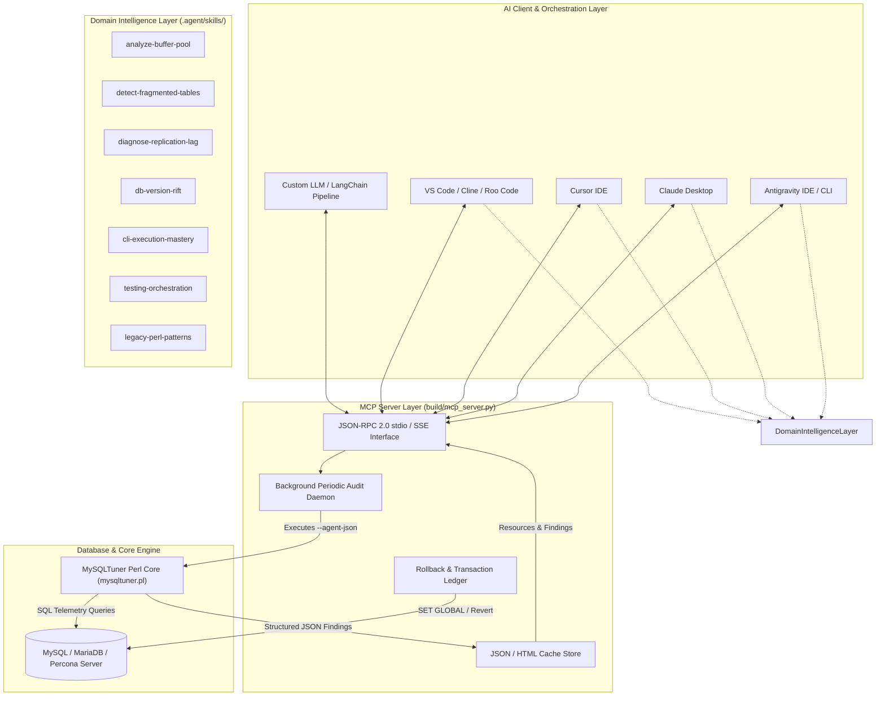

# AI Agent Integration, Model Context Protocol (MCP) & Agent Skills Guide

This guide provides exhaustive technical documentation for integrating MySQLTuner with Artificial Intelligence (AI) agents, LLM coding assistants, autonomous database administration (DBA) pipelines, and IDE environments using the **Model Context Protocol (MCP)**, **AI Agent Skills Subsystem**, and direct `--agent-json` CLI telemetry.

---

## 🏗️ Architecture & Component Overview

MySQLTuner provides a zero-dependency, container-ready AI integration stack. It bridges database engine metrics with modern AI clients (such as Antigravity, Claude Desktop, Cursor IDE, VS Code extensions, and LangChain/LlamaIndex frameworks).



---

## 🔌 Part 1: Model Context Protocol (MCP) Server Interface

The MySQLTuner MCP server ([build/mcp_server.py](file:///build/mcp_server.py)) implements the open [Model Context Protocol](https://modelcontextprotocol.io/) specification over standard input/output (`stdio`) transport using JSON-RPC 2.0.

### 🛠️ Exposed MCP Tools (Actions)

Agents invoke these JSON-RPC methods to interact dynamically with the database environment:

#### 1. `get_latest_audit`
* **Purpose**: Retrieves cached audit findings instantly without sending queries to the database server.
* **Arguments**: None.
* **Response Payload**:
  ```json
  {
    "status": "success",
    "timestamp": "2026-08-30T10:00:00Z",
    "findings_count": 5,
    "findings": [
      {
        "id": "innodb_buffer_pool_size_adjust",
        "topic": "Performance",
        "impact_score": 9,
        "risk_level": "Medium",
        "action": {
          "type": "SQL",
          "statement": "SET GLOBAL innodb_buffer_pool_size = 1073741824;",
          "rollback_statement": "SET GLOBAL innodb_buffer_pool_size = 134217728;"
        }
      }
    ]
  }
  ```

#### 2. `run_audit`
* **Purpose**: Triggers a live on-demand execution of `mysqltuner.pl --agent-json`, refreshes internal cache stores, and returns real-time findings.
* **Arguments**: None.
* **Response**: Fresh diagnostic findings and calculated health scores.

#### 3. `apply_recommendation`
* **Purpose**: Applies a safe, dynamic SQL tuning adjustment (`SET GLOBAL`) and registers a transactional snapshot for instant rollback.
* **Arguments**:
  - `statement` (string, required): The SQL command to execute (e.g. `SET GLOBAL max_connections = 300;`).
  - `variable_name` (string, optional): Target variable to capture pre-execution baseline.
* **Response**:
  ```json
  {
    "status": "applied",
    "statement_id": "tx_20260830_001",
    "statement": "SET GLOBAL max_connections = 300;",
    "original_value": "151"
  }
  ```

#### 4. `rollback_recommendation`
* **Purpose**: Reverts a previously executed command using recorded transaction state.
* **Arguments**:
  - `statement_id` (string, required): The transaction identifier returned by `apply_recommendation`.
* **Response**:
  ```json
  {
    "status": "rolled_back",
    "statement_id": "tx_20260830_001",
    "restored_statement": "SET GLOBAL max_connections = 151;"
  }
  ```

---

### 📊 Exposed MCP Resources (Observability)

Agents can query the following URI resources to read telemetry without executing methods:

| URI Resource | Content Type | Description |
| :--- | :--- | :--- |
| `mysqltuner://reports/latest.json` | `application/json` | Accesses the latest cached JSON report containing findings and DB variables status. |
| `mysqltuner://reports/latest.html` | `text/html` | Retrieves the interactive HTML analytics report (pgBadger-style visuals). |
| `mysqltuner://indicators/summary.json` | `application/json` | Provides high-level KPI indicators (Performance, Security, Resilience scores). |

---

## 🧠 Part 2: AI Agent Skills Subsystem

Skills represent structured domain knowledge capsules located in `.agent/skills/`. While MCP tools provide the **execution mechanism**, Agent Skills provide the **diagnostic intelligence, mathematical evaluation formulas, and safety guardrails**.

### 📚 Skills Directory & Capabilities Catalog

```
.agent/skills/
├── analyze-buffer-pool/        # InnoDB Buffer Pool sizing and concurrency
├── cli-execution-mastery/      # CLI arguments, authentication, connection modes
├── db-version-rift/            # MySQL vs MariaDB version matrix and deprecations
├── detect-fragmented-tables/   # Table fragmentation, disk recovery, online defrag
├── diagnose-replication-lag/   # Replication latency, GTID sync, worker saturation
├── legacy-perl-patterns/       # Perl 5.8+ backward compatibility rules
└── testing-orchestration/      # Tripartite testing, prove, test laboratories
```

#### 1. `analyze_buffer_pool` ([`SKILL.md`](file:///.agent/skills/analyze-buffer-pool/SKILL.md))
* **Objective**: Analyzes memory pressure, caching efficiency, and dirty page write stalls in InnoDB.
* **Formulas**:
  - Buffer Pool Hit Ratio: $\frac{\text{read\_requests} - \text{reads}}{\text{read\_requests}} \times 100$ ($\ge 99\%$ is optimal).
  - Dirty Page Ratio: $\frac{\text{pages\_dirty}}{\text{pages\_total}} \times 100$ ($> 75\%$ indicates flushing stalls).
* **Recommendations**: Proposes dynamic `SET GLOBAL innodb_buffer_pool_size` adjustments and multi-instance splitting (`innodb_buffer_pool_instances >= 8` for pools $> 1\text{GB}$).

#### 2. `cli-execution-mastery` ([`SKILL.md`](file:///.agent/skills/cli-execution-mastery/SKILL.md))
* **Objective**: Selects optimal CLI parameters for database connections across TCP/IP, Unix sockets, SSH tunnels, and container boundaries.
* **Guardrails**: Automatic password masking and validation of credential flags.

#### 3. `db-version-rift` ([`SKILL.md`](file:///.agent/skills/db-version-rift/SKILL.md))
* **Objective**: Bridges behavioral and variable differences between MySQL (5.5, 5.6, 5.7, 8.0, 8.4 LTS, 9.x) and MariaDB (10.3 to 11.8 LTS).
* **Usage**: Prevents referencing deprecated or engine-specific variables (e.g. `query_cache_size` removed in MySQL 8.0, alive in MariaDB).

#### 4. `detect-fragmented-tables` ([`SKILL.md`](file:///.agent/skills/detect-fragmented-tables/SKILL.md))
* **Objective**: Identifies tables with high data/index fragmentation and calculates reclaimable disk capacity.
* **Formulas**: Reclaimable Space = `Data_free`, Fragmentation Ratio = $\frac{\text{Data\_free}}{\text{Data\_length} + \text{Index\_length}} \times 100$.
* **Safety**: Evaluates storage engine locking implications (`InnoDB` online vs `MyISAM` table locks) before generating `OPTIMIZE TABLE` or `ALTER TABLE ... ENGINE=InnoDB` commands.

#### 5. `diagnose-replication-lag` ([`SKILL.md`](file:///.agent/skills/diagnose-replication-lag/SKILL.md))
* **Objective**: Diagnoses replication delay, IO/SQL thread errors, GTID consistency, and multi-threaded parallel replication worker saturation.
* **Metrics Analyzed**: `Seconds_Behind_Master`, `Slave_IO_Running`, `Slave_SQL_Running`, `Replica_parallel_workers`.

#### 6. `legacy-perl-patterns` ([`SKILL.md`](file:///.agent/skills/legacy-perl-patterns/SKILL.md))
* **Objective**: Ensures all Perl modifications preserve strict compatibility with legacy Perl versions (Perl 5.8+) without third-party CPAN dependencies.

#### 7. `testing-orchestration` ([`SKILL.md`](file:///.agent/skills/testing-orchestration/SKILL.md))
* **Objective**: Enforces tripartite test validation (`--verbose`, `--container`, `--dumpdir`), lab validation, and subtest decomposition.

---

### 🧩 Creating a Custom Agent Skill

To author a new domain skill:
1. Create `.agent/skills/<skill-id>/SKILL.md`.
2. Add YAML frontmatter:
   ```yaml
   ---
   name: custom_skill_name
   description: Brief description of the diagnostic skill.
   trigger: explicit_call
   category: skill
   ---
   ```
3. Include sections: `## 🧠 Purpose`, `## 📋 Preconditions`, `## 🛠️ Input Parameters`, `## 📊 Evaluation Criteria & Thresholds`, and `## 🛡️ Guardrails & Safety`.
4. Run `/doc-sync` to update the repository skill registry.

---

## ⚡ Part 3: Direct CLI Machine Telemetry (`--agent-json`)

For lightweight or single-pass executions without a running daemon, invoke `mysqltuner.pl` with `--agent-json`:

```bash
perl mysqltuner.pl --agent-json --host 127.0.0.1 --user root --pass secret
```

### JSON Finding Schema Definition
```json
{
  "findings": [
    {
      "id": "innodb_buffer_pool_size_adjust",
      "topic": "Performance",
      "description": "InnoDB buffer pool size is under-allocated for current workload.",
      "impact_score": 9,
      "risk_level": "Medium",
      "risk_description": "Increases memory consumption. Ensure sufficient OS-free RAM to prevent OOM swapping.",
      "requires_restart": false,
      "expected_outcome": "Reduces disk I/O and increases query cache read hits.",
      "action": {
        "type": "SQL",
        "statement": "SET GLOBAL innodb_buffer_pool_size = 1073741824;",
        "rollback_statement": "SET GLOBAL innodb_buffer_pool_size = 134217728;"
      }
    }
  ]
}
```

---

## 🚀 Part 4: Deployment & Client Integration

### Containerized MCP Deployment

Run the containerized MCP service alongside your database:

```bash
docker run -d \
  --name mysqltuner-mcp \
  -e DB_HOST=mysql-server \
  -e DB_PORT=3306 \
  -e DB_USER=root \
  -e DB_PASSWORD=secret_pass \
  -e AUDIT_INTERVAL_HOURS=6 \
  -v /var/cache/mysqltuner:/var/cache/mysqltuner \
  mysqltuner-mcp
```

### Client IDE Configurations

#### 1. Antigravity IDE (`mcp_config.json`)
```json
{
  "mcpServers": {
    "mysqltuner": {
      "command": "docker",
      "args": [
        "run",
        "-i",
        "--rm",
        "-e", "DB_HOST=127.0.0.1",
        "-e", "DB_USER=root",
        "-e", "DB_PASSWORD=secret_pass",
        "mysqltuner-mcp"
      ]
    }
  }
}
```

#### 2. Claude Desktop (`claude_desktop_config.json`)
```json
{
  "mcpServers": {
    "mysqltuner": {
      "command": "docker",
      "args": [
        "run",
        "-i",
        "--rm",
        "-v", "/var/cache/mysqltuner:/var/cache/mysqltuner",
        "-e", "DB_HOST=host.docker.internal",
        "-e", "DB_USER=root",
        "-e", "DB_PASSWORD=your_password",
        "mysqltuner-mcp"
      ]
    }
  }
}
```

#### 3. Cursor IDE
In **Settings** -> **Features** -> **MCP**, add:
* **Name**: `mysqltuner`
* **Type**: `stdio`
* **Command**: `python3 /path/to/MySQLTuner-perl/build/mcp_server.py`

#### 4. VS Code (Cline / Roo Code)
Add to `mcpSettings.json`:
```json
{
  "mcpServers": {
    "mysqltuner": {
      "command": "python3",
      "args": ["/path/to/MySQLTuner-perl/build/mcp_server.py"],
      "env": {
        "DB_HOST": "127.0.0.1",
        "DB_USER": "root",
        "DB_PASSWORD": "your_password"
      }
    }
  }
}
```

---

## 🧪 Testing the MCP Server

Validate the MCP Server implementation using the end-to-end test suite:

```bash
make test-mcp-e2e
```

Or execute directly via `prove`:
```bash
prove -v tests/e2e_mcp_server.t
```
commendation`.
```
