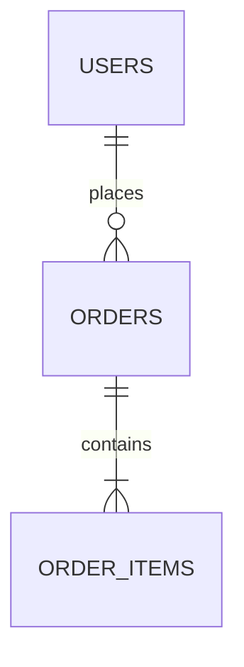

# Specification: --schemadir option for Schema Documentation

## Goal

Implement the `--schemadir` CLI option to dump complete database table structures, naming convention deviations, and index metadata to a specified directory.

- **Feature Name**: --schemadir option
- **Status**: Draft
- **Created Date**: 2026-01-27

## 🧠 Rationale

Currently, schema documentation generation is tied to the `--dumpdir` option and produces a single file. Users need a way to generate this documentation independently and optionally have one file per schema for better organization and integration with other tools (e.g., wiki systems).

## 🛠️ User Scenarios

### Scenario 1: Isolated Schema Documentation

A DBA wants to generate markdown documentation for all databases into a specific folder to be uploaded to a corporate wiki. They don't want the other CSV files generated by `--dumpdir`.

- **Command**: `mysqltuner.pl --schemadir /path/to/docs`
- **Result**: `/path/to/docs/db1.md`, `/path/to/docs/db2.md`, etc.

### Scenario 2: Legacy Compatibility

A user continues to use `--dumpdir` as before.

- **Command**: `mysqltuner.pl --dumpdir /path/to/dump`
- **Result**: `/path/to/dump/schema_documentation.md` (single file) and other CSVs.

### Scenario 3: Combined Usage

A user wants both the dump files and the split schema documentation.

- **Command**: `mysqltuner.pl --dumpdir /path/to/dump --schemadir /path/to/docs`
- **Result**: Both sets of files are created.

## 📋 User Stories

| Independent Option | P1 | As a user, I want a dedicated `--schemadir` option | To avoid coupling schema docs with other dumps | GIVEN `--schemadir` is provided, WHEN script runs, THEN MD files are created in that dir. |
| One File per Schema | P1 | As a user, I want one `.md` file per schema | For better navigability and wiki integration | GIVEN `--schemadir` is used, THEN each database has its own MD file. |
| Mermaid ER Diagrams | P1 | As a user, I want embedded Mermaid ER diagrams | To visually render table relationships and foreign keys | GIVEN foreign keys exist, THEN an `erDiagram` code block is embedded in each schema file. |
| Dumpdir Compatibility | P2 | As a user, I want `--dumpdir` to still work as before | To avoid breaking existing workflows | GIVEN `--dumpdir` is used, THEN `schema_documentation.md` is created as a single file. |
| Automatic Directory Creation | P2 | As a user, I want the target directory to be created if it doesn't exist | To simplify usage | GIVEN `--schemadir` points to a non-existent path, WHEN script runs, THEN directory is created. |

## 📊 Mermaid ER Diagram Specification
Each generated Markdown file contains an embedded Mermaid ER diagram block:

Tables and column definitions specify primary keys (`PK`), foreign keys (`FK`), and column nullability.

- **Unit Test**: Mock database metadata and verify that `mysql_tables` correctly identifies schemas and writes to separate files when `schemadir` is set.
- **Integration Test**: Run against a real database (multi-version lab) and check the filesystem structure.

## Verification

- Validated via `tests/schemadir.t`.
- Confirms creation of schema SQL and CSV audit files in the target directory.
